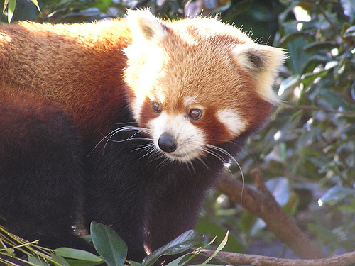
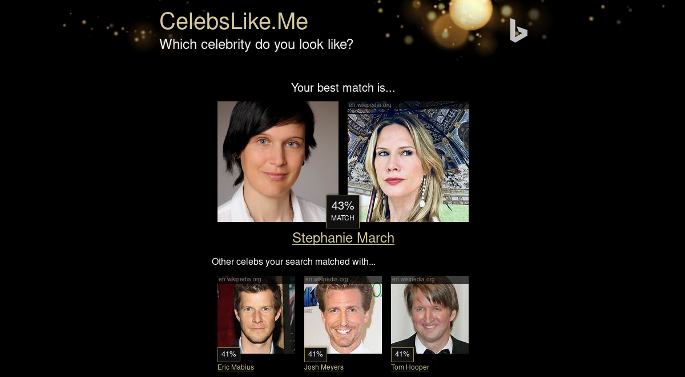
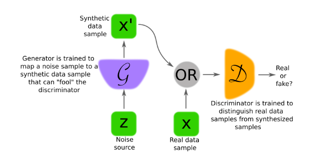
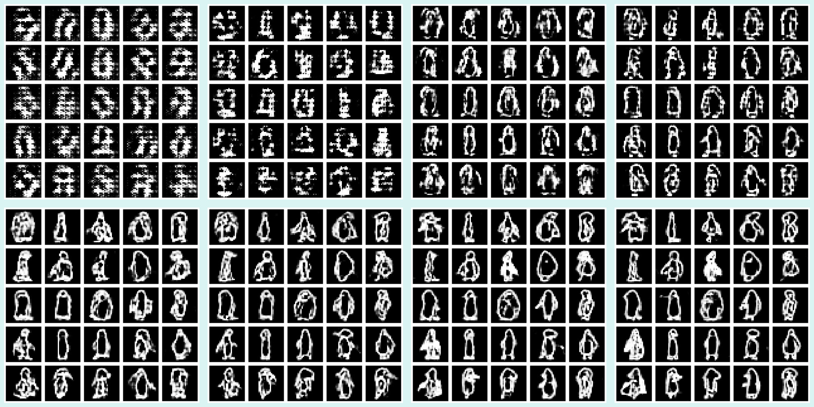
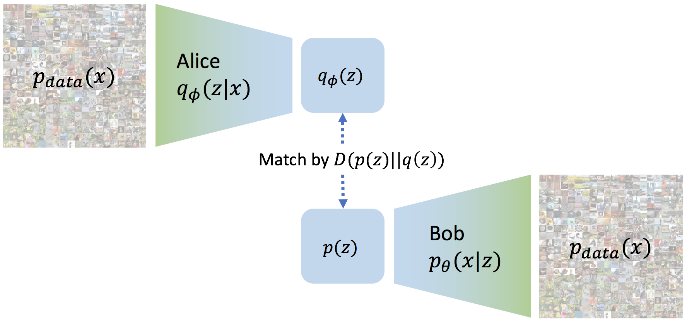
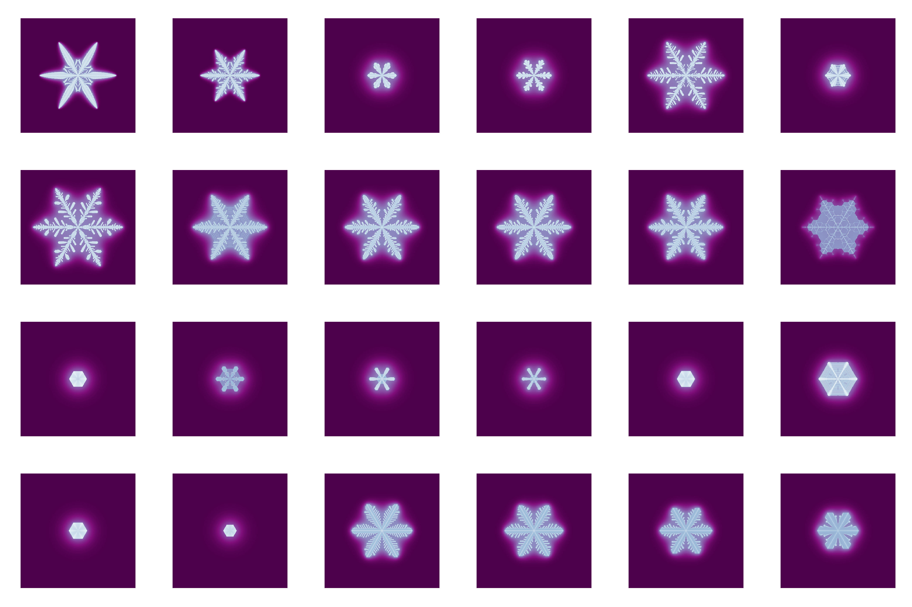
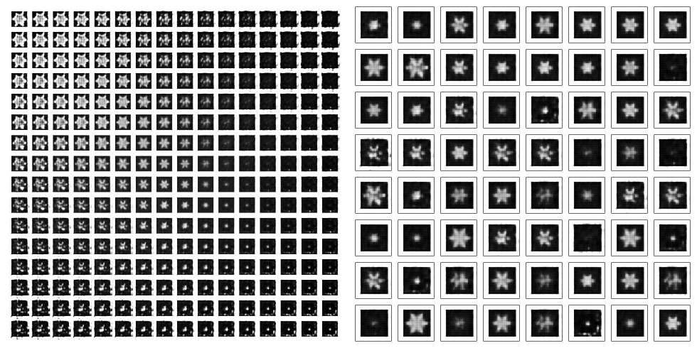

class: inverse, middle, center

#So deep learning is easy...

---
# Red panda? Or giant panda?

<br />




---
# Just use the Keras Sequential API ...

```{r, eval=FALSE}
{{model <- keras_model_sequential() %>%}}
  layer_conv_2d(...) %>% 
  layer_max_pooling_2d(...) %>% 
  layer_conv_2d(...) %>% 
  layer_max_pooling_2d(...) %>% 
  layer_conv_2d(...) %>% 
  layer_max_pooling_2d(...) %>% 
  layer_flatten() %>% 
  layer_dense(units = 1, activation = "sigmoid")

{{model %>% compile(}}
  loss = "binary_crossentropy",
  optimizer = "adam",
  metrics = c("accuracy")
)

{{model %>% fit(}}
  x_train, y_train,
  epochs = epochs,
  validation_split = 0.2
)

```


---
# Who do I look like?





_Okay_ ...

---
# The Keras Functional API has you covered ...

```{r, eval=FALSE}
input <- layer_input(shape = c(224, 224, 3))
output <- digit_input %>% 
  # lots of conv layers here
  layer_flatten()

shared_model <- keras_model(input, output)

# compile, train ...

# now use to say if 2 people are the same
person_a <- layer_input(shape = c(224, 224, 3))
person_b <- layer_input(shape = c(224, 224, 3))

out_a <- person_a %>% shared_model
out_b <- person_b %>% shared_model

out <- layer_concatenate(c(out_a, out_b)) %>% 
  layer_dense(units = 1, activation = "sigmoid")

classification_model <- keras_model(inputs = c(person_a, person_b), out)
```


---
# The world needs more penguins...


<br />

Let's get creative!


- Generative adversarial networks (GANs)

- Variational autoencoders (VAEs)


---
# Not MNIST: Google Quick, Draw!

<br /> 


---
# Generative adversarial networks: It's a game

<br />

<figure>

<figcaption><br />Image source: https://arxiv.org/pdf/1710.07035.pdf</figcaption>
</figure>


---
# Coding a GAN, the static graph way

1. Define generator and discriminator models.

2. Freeze discriminator weights and define an overall model as $$GAN = f(\ discriminator\ (\ generator(\ random\_input\ )))$$ Discriminator weights are frozen in GAN model only!

4. Training: For each epoch, iterate over data batches:
 
 - generate fake images with generator
 
 - call discriminator on fake as well as real images, with targets "fake" and "real", and do backprop on discriminator
 
 - train GAN on random noise, with targets "real", and do backprop on generator only
 
 <br />
 

---
class: inverse, middle, center

# Eager execution: All in the game, yo


---
# Aside: Keras custom models


- Can be used with static as well as with eager execution

- Documentation: [https://tensorflow.rstudio.com/keras/articles/custom_models.html](https://tensorflow.rstudio.com/keras/articles/custom_models.html)

```{r, eval=FALSE}
keras_model_simple_mlp <- function(num_classes, name = NULL) {
  
  # define and return a custom model
  keras_model_custom(name = name, function(self) {
    
    # create layers we'll need for the call (this code executes once)
    self$dense1 <- layer_dense(units = 32, activation = "relu")
    self$dense2 <- layer_dense(units = num_classes, activation = "softmax")
    
    # implement call (this code executes during training & inference)
    function(inputs, mask = NULL) {
      self$dense1(inputs) %>%
        self$dense2()
    }
  })
}
```

---
# GAN for humans: The actors (1)


First, the ingenious fraudster ...


```{r, eval=FALSE}
generator <-
  function(name = NULL) {
    keras_model_custom(name = name, function(self) {
      
      # define some conv and deconv layers here
      # deconvolution ("transposed convolution") does upsampling
      
      function(inputs,
               mask = NULL,
               training = TRUE) {
        
        # starting from random noise, apply successive conv and deconv layers
        # until we have a complete image of size 28x28x1
      }
    })
  }

generator <- generator()
```


---
# GAN for humans: The actors (2)

Next, the dutiful investigator ...

```{r, eval=FALSE}
discriminator <-
  function(name = NULL) {
    keras_model_custom(name = name, function(self) {
      
      # just some conv layers (with dropout, batch norm...)
      # followed by a 1-dim sigmoid activation
      
      function(inputs,
               mask = NULL,
               training = TRUE) {
        
        # do stuff
        
      }
    })
  }

discriminator <- discriminator()
```


---
# They have different goals...


Discriminator: I need to make sure I spot the fake

```{r, eval=FALSE}
discriminator_loss <- function(real_output, generated_output) {
  real_loss <-
    tf$losses$sigmoid_cross_entropy(multi_class_labels = k_ones_like(real_output),
                                    logits = real_output)
  generated_loss <-
    tf$losses$sigmoid_cross_entropy(multi_class_labels = k_zeros_like(generated_output),
                                    logits = generated_output)
  real_loss + generated_loss
}

```


Generator: I need to fool that guy

```{r, eval=FALSE}
generator_loss <- function(disc_verdict) {
  tf$losses$sigmoid_cross_entropy(tf$ones_like(disc_verdict), disc_verdict)
}
```


---
# Let the game begin!


```{r, eval=FALSE}

# iterate over epochs
  for (epoch in seq_len(num_epochs)) {
    
    iter <- make_iterator_one_shot(train_dataset)
    
    # iterate over dataset
    until_out_of_range({
      
      with(tf$GradientTape() %as% gen_tape, {
        with(tf$GradientTape() %as% disc_tape, {
          
          # record what our actors are doing
          # calculate their respective losses, too
          
        })
      })
      
      # get gradients, separately for generator and discriminator, that is:
      # --> gradients of generator loss w.r.t. generator's weights
      # --> gradients of discriminator loss w.r.t. discriminator's weights
      
      # apply gradients, separately for generator and discriminator
   })
  }
```


---
# Let's see the penguins evolve



---
# Variational autoencoders: A search for the latent code

<br />

<figure>

<figcaption><br />Image source: https://ermongroup.github.io/blog/a-tutorial-on-mmd-variational-autoencoders/</figcaption>
</figure>

---
# Penguins want snow 

Problem: Where to get the training data? ... trying [Gravner-Griffeath](http://psoup.math.wisc.edu/papers/h2l.pdf)




---
# The goal is to find a sparse, informative latent code ...


Encoder:

```{r, eval=FALSE}
encoder_model <- function(name = NULL) {
  keras_model_custom(name = name, function(self) {
    # few conv layers and a dense layer for the latent code
    function (x, mask = NULL) {
      # pipe through conv layers and return code
    }
  })
}
```

Decoder:

```{r, eval=FALSE}
decoder_model <- function(name = NULL) {
  keras_model_custom(name = name, function(self) {
    # mainly, few deconv layers to upsample from code
    function (x, mask = NULL) {
     # successive upsampling, the output image
    }
  })
}
```


---
# Thus, here all action is in the loss function

<br />

$$k(z,z')=\frac{e^{||z-z'||}}{2\sigma^2}$$

```{r, eval=FALSE}
compute_kernel <- function(x, y) {
  # use Gaussian kernel to compute similarity
}

```

<br />

$$MMD(p(z)||q(z))=E_{p(z),p(z')}[k(z,z')]+E_{q(z),q(z')}[k(z,z')]−2E_{p(z),q(z')}[k(z,z')]$$
```{r, eval=FALSE}
compute_mmd <- function(x, y, sigma_sqr = 1) {
 
  # calculate maximum mean discrepancy (MMD)
}
```


---
# Then, it's just a straightforward training loop 

```{r, eval=FALSE}

# iterate over epochs
  for (epoch in seq_len(num_epochs)) {
    
    iter <- make_iterator_one_shot(train_dataset)
    
    # iterate over dataset
    until_out_of_range({
      
       with(tf$GradientTape(persistent = TRUE) %as% tape, {
        
        mean <- encoder(x) # data -> latent code
        preds <- decoder(mean) # code -> reconstruction
      
        # compute losses
        true_samples <- k_random_normal(shape = c(batch_size, latent_dim), dtype = tf$float32)
        loss_mmd <- compute_mmd(true_samples, mean)
        loss_nll <- k_mean(k_square(x - preds))
        loss <- loss_nll + loss_mmd
    })
      
    # compute encoder's and decoder's gradients
    # perform backprop on both of them
  }
```

---
# Let's see the snowflakes




---
# So, what else is there to eager execution?

<br />

- When in doubt, print it out

- Reduce duplicated / boilerplate code 

- Go beyond layer sequencing


---
# Easy debugging


Gradients? Loss? Actual values? Just print them

```{r, eval=FALSE}
with(tf$GradientTape() %as% gen_tape, {
  with(tf$GradientTape() %as% disc_tape, {
  
    generated_images <- generator(noise)
   {{print(generated_images)}}
    
    disc_real_output <- discriminator(batch, training = TRUE)
    disc_generated_output <- discriminator(generated_images, training = TRUE)
    
    gen_loss <- generator_loss(disc_generated_output)
   {{print(gen_loss)}}
    disc_loss <- discriminator_loss(disc_real_output, disc_generated_output)
  })
  
  gradients_of_generator <- gen_tape$gradient(gen_loss, generator$variables)
  gradients_of_discriminator <- disc_tape$gradient(disc_loss, discriminator$variables)
 {{print(gradients_of_discriminator)}}
})
```


---
# Modular code (1): Define reusable modules

```{r, eval=FALSE}
downsample <- function(# ...) {
  keras_model_custom(name = name, function(self) {
    
    # a conv layer, plus batchnorm, dropout ...
    
    function(x, mask = NULL, training = TRUE) {
      
      # (conditionally) call said layers
    }
  })
}
```


```{r, eval=FALSE}
upsample <- function(# ...) {
  keras_model_custom(name = name, function(self) {
    
    # dropout, deconv, batchnorm...
    
    function(xs, mask = NULL, training = TRUE) {
      
      # call layers and do stuff
    }
  })
}
```


---
# Modular code (2): Use them

```{r, eval=FALSE}
generator <- function(name = "generator") {
  
  keras_model_custom(name = name, function(self) {
    
    self$down1 <- downsample(64, 4, apply_batchnorm = FALSE)
    self$down2 <- downsample(128, 4)
    
    # and more and more ...
    
    self$up1 <- upsample(512, 4, apply_dropout = TRUE)
    self$up2 <- upsample(512, 4, apply_dropout = TRUE)
    # and more ...
    
    function(x,
             mask = NULL,
             training = TRUE) {
      x1 <- x %>% self$down1(training = training)  
      x2 <- self$down2(x1, training = training) 
      x3 <- self$down3(x2, training = training) 
      # and so on...
    }
  })
}

```


---
# Interleaving logic (1): Attention mechanism 

<br />

<figure>

<figcaption><br />Image source: https://arxiv.org/pdf/1502.03044.pdf</figcaption>
</figure>

---
# Interleaving logic (2): Attention mechanism

```{r, eval=FALSE}
rnn_decoder <- function(embedding_dim, gru_units, vocab_size, name = NULL) {
    
  keras_model_custom(name = name, function(self) {
      
    # ...
    self$attention <- attention_module(self$gru_units)
    
    function(inputs, mask = NULL) {
      x <- inputs[[1]]
      features <- inputs[[2]]
      hidden <- inputs[[3]]
        
      c(context_vector, attention_weights) %<-% 
        self$attention(list(features, hidden))
        
      # ...
      # ...
    }
  })
}
```


---
# Get the details

Documentation: [https://tensorflow.rstudio.com/keras/articles/eager_guide.html](https://tensorflow.rstudio.com/keras/articles/eager_guide.html)


Applications:

- [Representation learning with MMD-VAE](https://blogs.rstudio.com/tensorflow/posts/2018-10-22-mmd-vae/)

- [More flexible models with TensorFlow eager execution and Keras](https://blogs.rstudio.com/tensorflow/posts/2018-10-02-eager-wrapup/)

- [Image-to-image translation with pix2pix](https://blogs.rstudio.com/tensorflow/posts/2018-09-20-eager-pix2pix/)

- [Attention-based Image Captioning with Keras](https://blogs.rstudio.com/tensorflow/posts/2018-09-17-eager-captioning/)

- [Neural style transfer with eager execution and Keras](https://blogs.rstudio.com/tensorflow/posts/2018-09-10-eager-style-transfer/)

- [Generating images with Keras and TensorFlow eager execution](https://blogs.rstudio.com/tensorflow/posts/2018-08-26-eager-dcgan/)

- [Attention-based Neural Machine Translation with Keras](https://blogs.rstudio.com/tensorflow/posts/2018-07-30-attention-layer/)

---
# Next up: TensorFlow Probability w/ eager

```{r, eval=FALSE}
learnable_prior_model <- function(name = NULL, latent_dim, mixture_components) {
  
  keras_model_custom(name = name, function(self) {
    
    self$loc <- tf$get_variable(...)
    self$raw_scale_diag <- tf$get_variable(...)
    self$mixture_logits <- tf$get_variable(...)
      
    function (x, mask = NULL) {
        tfd$MixtureSameFamily(
          components_distribution = tfd$MultivariateNormalDiag(
            loc = self$loc,
            scale_diag = tf$nn$softplus(self$raw_scale_diag)
          ),
          mixture_distribution = tfd$Categorical(logits = self$mixture_logits)
        )
      }
    })
  }
```


See: [Getting started with TensorFlow Probability](https://blogs.rstudio.com/tensorflow/posts/2019-01-08-getting-started-with-tf-probability/)

---
# Thanks a lot for your attention!!


